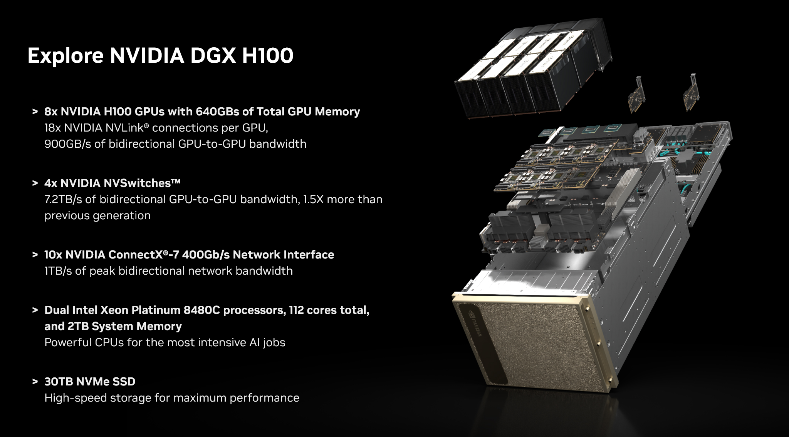

# NCHC Open Hackathon Cluster Environment (2025)

[](https://nchcopenhackathon2025.slack.com/)
[](https://nchcopenhackathon2025.slack.com/archives/C09LA565QJ0)

> Click the badges above for quick access to the Slack workspace and the `#cluster-support` channel.

> For cluster admins, please refer to the [INSTALL.md](INSTALL.md) file for installation and validation instructions.
>
> For normal users, please read this `README.md` file for instructions on how to access the cluster.

## Cluster Overview

| DGX A100 x2 | DGX H100 x2 |
|-------------|-------------|
| [](https://developer.nvidia.com/blog/defining-ai-innovation-with-dgx-a100/) | [](https://www.nvidia.com/en-us/data-center/dgx-h100/) |
| NVIDIA A100-SXM4-40GB x16 | NVIDIA H100 80GB HBM3 x16 |
| [DGX A100 Guide](#dgx-a100-guide) | [DGX H100 Guide](#dgx-h100-guide) |

Note that the two clusters (DGX A100 and DGX H100) have different environments and requirements. Please click the corresponding guide link above according to your assigned cluster.

## DGX A100 Guide

> For DGX H100 users, skip to the [DGX H100 Guide](#dgx-h100-guide) section.


Only the files stored under `/workspace` and `/root/.ssh` will be persistent. All other files will be lost when the container is stopped due to updates or machine reboot.

Since the cluster environment may differ from your local setup, unexpected issues may arise if certain requirements for your container aren't met in the cluster. If you encounter strange issues, don't stay stuck for too long, please coordinate with your mentors or reach out to the cluster administrator (`@Johnson Sun`) for assistance.

> **Warning:** Always store your files under the `/workspace` directory to avoid data loss when the container is restarted. Also make sure to keep a local backup of your files in case of unexpected issues.

### Credentials

Retrieve your access credentials from your team channel (or mentors) on Slack:

| **Name**       | **Placeholder** |
|----------------|-----------------|
| Team ID        |                 |
| SSH IP Address | `<YOUR_IP>`     |
| SSH Port       | `<YOUR_PORT>`   |
| SSH Password   | `<YOUR_PSWD>`   |

In the following commands, replace placeholders with your credentials.

### Access Cluster

Open a terminal and connect to the SSH server in the container:

```sh
ssh root@<YOUR_IP> -p <YOUR_PORT> -L 8888:localhost:8888 -L 6006:localhost:6006
```

Follow the instructions to enter the password and log in to the container.

```
The authenticity of host '[<YOUR_IP>]:<YOUR_PORT> ([<YOUR_IP>]:<YOUR_PORT>)' can't be established.
ED25519 key fingerprint is SHA256:XXXXXXXXXXXXXXXXXXXXXXXXXXXXXXXXXXXXXXXXXXX.
This key is not known by any other names.
Are you sure you want to continue connecting (yes/no/[fingerprint])? yes
Warning: Permanently added '[<YOUR_IP>]:<YOUR_PORT>' (ED25519) to the list of known hosts.
root@<YOUR_IP>'s password:
```

Note that the password will not be displayed as you type. In addition, if your docker container uses a different default user, you may want to log in as that user instead.

The `-L 8888:localhost:8888` flag forward port 8888 from the remote server to your local machine. This is useful for Jupyter Lab (http://localhost:8888), TensorBoard (http://localhost:6006), and other web-based tools. You can add as many `-L` flags as you need to forward additional ports.

To confirm your persistent storage is working, check the `README.txt` file in the `/workspace` directory:

```sh
cat /workspace/README.txt
```

You should see the following message:

```
Hi team-00, please store your team's data here.
```

If some of your services (such as Jupyter Lab) are suddenly not responding, check if your SSH connection has been disconnected.

For seamless SSH access without entering your password each time, consider [generating an SSH key pair](https://tutorial.j3soon.com/remote-development/openssh-server/#generate-ssh-key) (if you don't already have one) and [use `ssh-copy-id`](https://tutorial.j3soon.com/remote-development/openssh-server/#copy-ssh-public-key) to upload your public key to the server.

## DGX H100 Guide

> For DGX A100 users, skip this section.

For DGX H100, the tasks must be submitted via Slurm instead and has more constraints. You should have received a on-boarding document from the cluster administrator. If not, please contact `@Johnson Sun` for assistance.

On Slurm-based DGX H100 hosts, you cannot install custom libraries on the host system. To work around this, use container solutions such as Rootless Docker or Apptainer/Singularity.

Recommended workflow:
1. Prepare, build, and test your Docker image on your own local machine.
2. Copy the Docker image to the cluster nodes or upload it to Docker Hub.
3. Optionally, convert the Docker image to an Apptainer image if needed.
4. Launch your container via Slurm extensions/modules on the DGX H100 cluster.

Note that CUDA, cuDNN, cuBLAS, and other library versions will depend on those provided in your Docker image.

## FAQ

Q: How to launch Jupyter Lab?

A: Jupyter Lab should already be running on port 8888 (for DGX A100 users).

```sh
ssh root@<YOUR_IP> -p <YOUR_PORT> -L 8888:localhost:8888
# and then open http://localhost:8888 on your local machine
```

If Jupyter Lab is not running, you can launch it by running the following command:

```sh
# optionally, lauch tmux to keep the session running
jupyter lab --allow-root --NotebookApp.token="" --notebook-dir=/workspace
# and then open http://localhost:8888 on your local machine
```

Q: SSH Tunneling with MobaXterm?

A: I personlly perfer using command line for SSH tunneling, but if you prefer GUI, see: <https://superuser.com/a/1602218>.

Q: `E: Unable to locate package` during `apt install`?

A: Run `apt update` first.

Q: `Remote Host Identification Has Changed` during SSH after container update.

A: Follow the error message's suggestion and run the following on your local machine:

```sh
ssh-keygen -f "~/.ssh/known_hosts" -R "[<IP>]:<PORT>"
```

Q: Error during using rootless docker (for DGX H100 users)?

```sh
Server:
ERROR: Cannot connect to the Docker daemon at unix:///raid/scratch/tmp/xdg_runtime_dir_xxxx/docker.sock. Is the docker daemon running?
```

A: Try the following:

```sh
module load slurm
sinfo
srun -p primary --ntasks=1 --nodes=1 \
     --time=12:00:00 --gres=gpu:2 \
     --pty /bin/bash
 
# in srun context
nvidia-smi -L

ls /raid/scratch/tmp

module load rootless-docker

export TEAM_UID=team00 # change this to your team ID
export XDG_RUNTIME_DIR=/raid/scratch/tmp/xdg_runtime_dir_${TEAM_UID}
export DOCKER_DATAROOT=/raid/containers/tmp/docker-container-storage-${TEAM_UID}
export DOCKER_HOST=unix:///raid/scratch/tmp/xdg_runtime_dir_${TEAM_UID}/docker.sock
export DBUS_SESSION_BUS_ADDRESS=unix:path=/run/user/${TEAM_UID}/bus

start_rootless_docker.sh -quiet

docker images

docker run --rm -it --gpus all nvcr.io/nvidia/pytorch:25.09-py3 bash

# in container
nvidia-smi -L
```

If you still encountered the same errors, try use `srun -w <node name> ...` to run the command on some other node.

## Questions

- For general questions, tag `@Johnson Sun` in the [#cluster-support](https://nchcopenhackathon2025.slack.com/archives/C09LA565QJ0) channel on Slack
- For team-specific questions, tag `@Johnson Sun` directly in your team channel.
