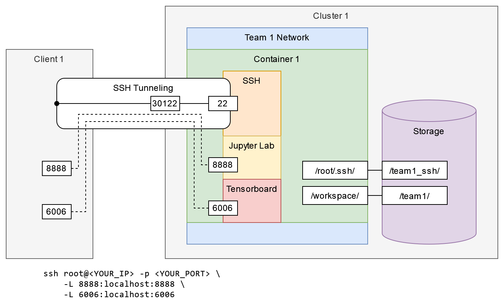

# NCHC Open Hackathon Cluster Environment (2024)

[](https://nchc-open-hackathon.slack.com/)
[](https://nchc-open-hackathon.slack.com/archives/C07U5R5ULSY)

> Click the badges above for quick access to the Slack workspace and the `#cluster-support` channel.

## Cluster Overview

DGX A100:

[](https://developer.nvidia.com/blog/defining-ai-innovation-with-dgx-a100/)

Cluster Details:



Only the files stored under `/workspace` and `/root/.ssh` will be persistent. All other files will be lost when the container is stopped.

Since the cluster environment may differ from your local setup, unexpected issues may arise if certain requirements for your container aren't met in the cluster. If you encounter strange issues, don't stay stuck for too long, please coordinate with your mentors or reach out to the cluster administrator (`@Johnson Sun`) for assistance.

## Credentials

Retrieve your access credentials from your team channel (or mentors) on Slack:

| **Name**       | **Placeholder**  |
|----------------|------------------|
| Team ID        | `<YOUR_TEAM_ID>` |
| SSH IP Address | `<YOUR_IP>`      |
| SSH Password   | `<YOUR_PSWD>`    |
| SSH Port       | `<YOUR_PORT>`    |

In the following commands, replace placeholders with your credentials.

## Access Cluster

```sh
ssh root@<YOUR_IP> -p <YOUR_PORT> -L 8888:localhost:8888 -L 6006:localhost:6006
```

```
The authenticity of host '[<YOUR_IP>]:<YOUR_PORT> ([<YOUR_IP>]:<YOUR_PORT>)' can't be established.
ED25519 key fingerprint is SHA256:XXXXXXXXXXXXXXXXXXXXXXXXXXXXXXXXXXXXXXXXXXX.
This key is not known by any other names.
Are you sure you want to continue connecting (yes/no/[fingerprint])? yes
Warning: Permanently added '[<YOUR_IP>]:<YOUR_PORT>' (ED25519) to the list of known hosts.
root@<YOUR_IP>'s password:
```

Note that the password will not be displayed as you type. In addition, if your docker container uses a different default user, you may want to log in as that user instead.

The `-L 8888:localhost:8888` flag forward port 8888 from the remote server to your local machine. This is useful for Jupyter notebooks and other web-based tools. You can add as many `-L` flags as you need to forward additional ports.

If some of your services (such as Jupyter Lab) are suddenly not responding, check if your SSH connection has been disconnected.

## FAQ

- How to launch Jupyter Lab?
  ```sh
  # optionally, lauch tmux to keep the session running
  jupyter lab --allow-root --NotebookApp.token="" --notebook-dir=/workspace
  # and then open http://localhost:8888
  ```
- SSH Tunneling with MobaXterm?
  - I personlly perfer using command line for SSH tunneling, but if you prefer GUI, see: <https://superuser.com/a/1602218>.

- `E: Unable to locate package` during `apt install`?
  - Run `apt update` first.

## Questions

- For general questions, tag `@Johnson Sun` in the [#cluster-support](https://nchc-open-hackathon.slack.com/archives/C07U5R5ULSY) channel on Slack
- For team-specific questions, tag `@Johnson Sun` directly in your team channel.
